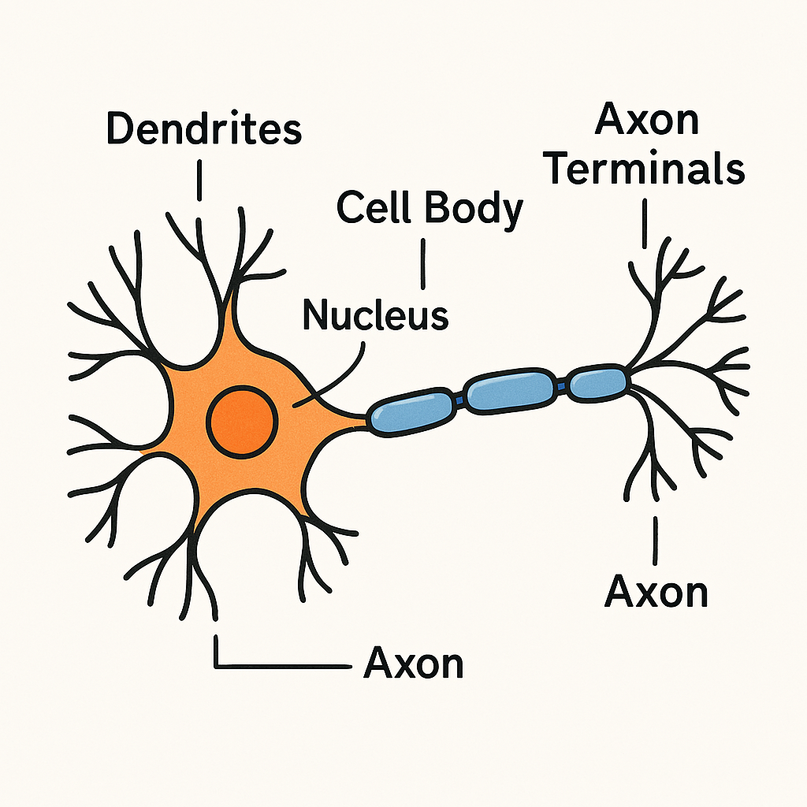
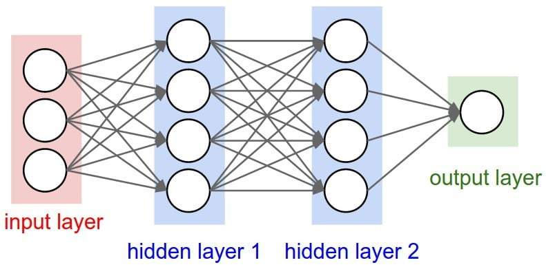
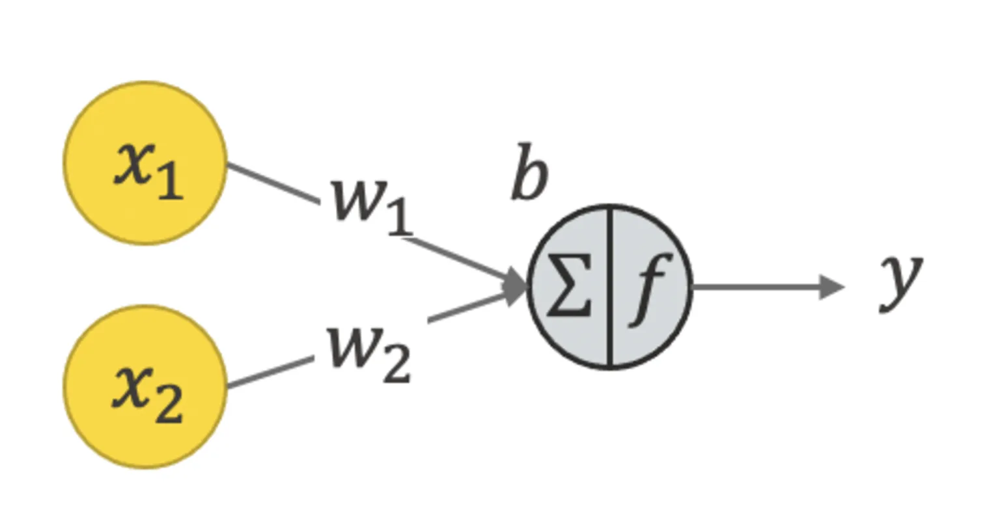
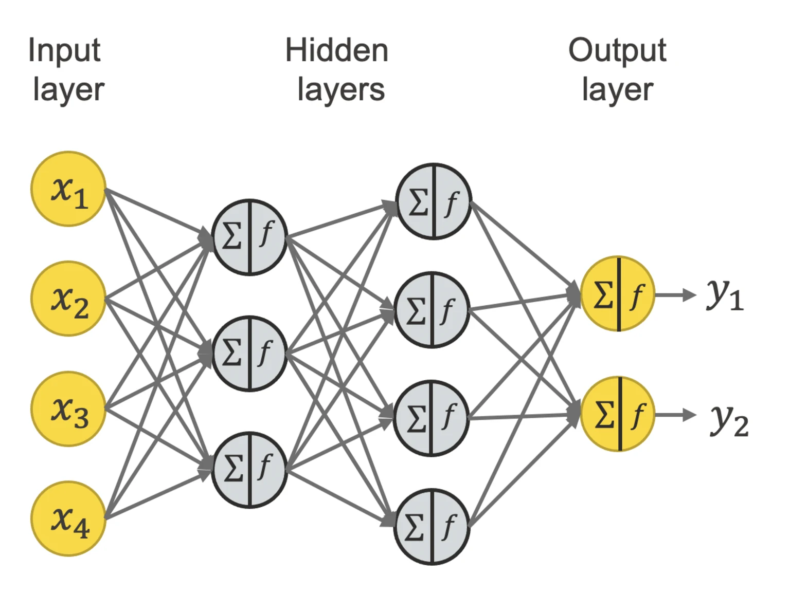
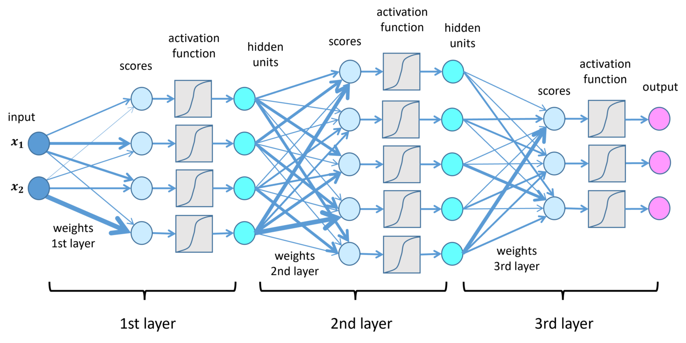
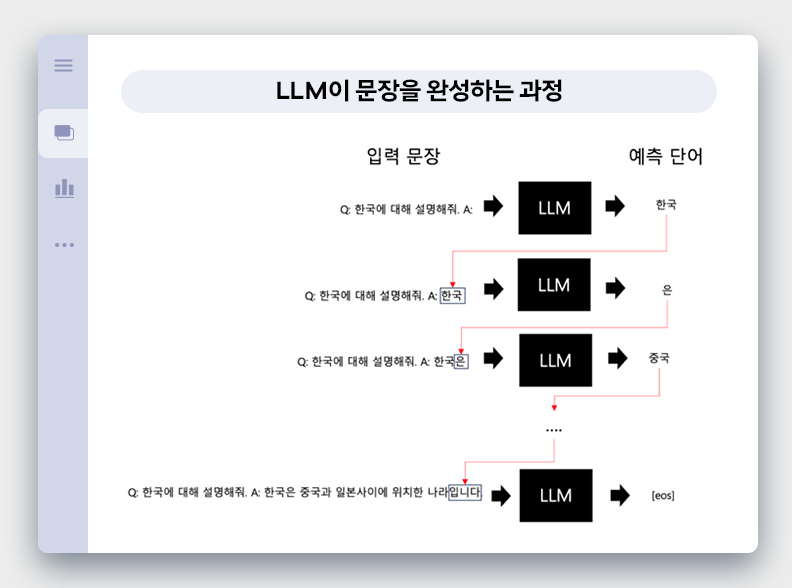

# AI : LLM
### 머신 러닝 구조
##### 뉴런
- 
- 화학적
- 복잡
  
##### 컴퓨터
- 
- 순차적
- 병렬계산 : GPU
- 조단위 파라미터
  
### 발전
- 아이디어 : 1950년대 등장
- 하드웨어 발전 기다림
- 기본구조
    - 1차식 : y = ax + b
    - 
    - 
    - 입력 => 모델 => 출력 : 만능상자
    - 
- 기술력
    - 모델 : 학습 ⇔ 검증 => 추론
    - 모델을 어떻게 구성하느냐
    - 모델을 어떻게 학습하느냐
        - 양질의 학습자료
        - 어떻게 효율적으로 정확하게 a,b 값을 움직이느냐
- 이미지, 오디오, 동영상 분석 / 생성
- 자율주행
- 등등 (입력, 출력을 정의해서, 상상하기 나름)
- 패턴과 규칙이 강한 분야 일수록 더 쉬움
- LLM : 언어 => 언어
    - 다음단어(토큰) 예측
    - 
    - 질문 : 답
    - 지문 : 이어서 작성
    - 대화의 총 크기 제한이 있음 : 토큰기준 약 128K : 모델마다 다름
      
### 종류
##### 구분
- 모델
    - API
    - 서비스
- 요청방식
  인풋이 누적
    - 질문1 : => 답1
    - 질문1:답1,질문2: => 답2
    - 질문1:답1,질문2:답2,질문3: => 답3
     
##### 모델
 API를 통해 직접 접근이 가능
 사용량에 따른 과금
 API 테스팅 툴 제공
- openai
  범용
    - GPT-4.5
    - GPT-o3-mini
    - GPT-4o
    - GPT-4o mini
- 구글
    - Gemini 2.5 Pro
    - Gemini 2.0 Flash
- Anthropic
  코딩
    - Claude 3.7 Sonnet
- xAI
    - Grok-3 : 아직 API없음
- DeepSeek
    - DeepSeek R1
- 기타 등등..
- 1~3개월 주기로 모델이 새로나오고 성능이 계속 좋아짐
  
##### 서비스
 모델을 사용하기 쉽게 서비스함
- 월별 과금
    - 무료
    - 월정액유저(3만)
    - 프로 월정액유저(10만~)
- 모델 제작 업체
    - openAI
    - 구글
    - Anthropic
    - xAI
    - DeepSeek
- 위의 모델들을 사용해한 서비스 플렛폼은 **정말 많음**..
- 대화 서비스
    - 퍼플렉시티
    - 뤼튼
    - ...
- 툴제공, 연동
    - GitHub Copilot
    - 노션
    - Cursor
    - ...
- 에이전트
    - 마누스
    - ...

### 활용
##### 즉답
- 간단한질문
    - 만능 백과사전
    - 텍스트 생성
- 구문검색
  
    - c# 에서 `class abc(int i, float b) { ...` 이건뭐야?
    - c# ? ?? 차이

##### 대화
- 주거니 받거니

##### 툴사용
- 검색
    - 웹검색 자료를 추가로 입력에 활용
- FunctionCall
    - LLM 요청시 역으로 내가 결과를 줄수있는 것들의 함수형태를 알려주면 LLM이 나에게 결과를 물어보고 그걸기반으로 대답을 해줌
```json
{
    "ReadEmail" : {
        "Description" : "받은 메일들을 반환 (기간: StartTime ~ EndTime)"
        "Args" : [
            "StartTime" : {
                "Type" : "DateTime",
                "Description" : "메일을 확인할 시작시간"
            },
            "EntTime" : {
                "Type" : "DateTime",
                "Description" : "메일을 확인할 끝시간. 없으면 최신"
            }
        ],
        "Result" : {
            "Type" : "List<String>",
            "Description" : "메일 배열을 반환"
        }
    },
    "GetNowTime" : { 
        "Description" : "지금 시간을 반환"
        ...
    },
    "SendMail" : { 
        "Description" : "메일을 보냄"
        ...
    },
    ...
}
```
- "5일간의 메일을 확인해서 광고와 청구서, 대화로 분리하고 각 내용들을 정리해줘"
1. LLM 응답 : "5일전의 시간계산을 위해 현재시간을 확인하겠습니다."
```json
{
    "type": "function",
    "function": {
        "name": "GetNowTime",
    }
}
```
2. 사용자 응답
```json
{
    "type": "Function Answer",
    "GetNowTime": "2025-03-07 17:04:00"
}
```
3. LLM 응답 : ReadEmail 함수 호출
4. 사용자 : 함수 호출에 대한 응답
6. LLM : 정리결과 응답
7. 사용자 다시 요청 : "그 내용을 xxxx@xxx.com 에 메일로 보내줘"
8. LLM : SendMail 함수 호출
9. ...
    
- MCP
    - Anthropic에서 함수들을 정의하고 호출하고 응답하는 공통 표준 인테페이스를 발표
    - 어느정도 똑똑한 LLM이라면 MCP 규약을 알아듣고 사용함
    - 사용자는 마켓플레이스처럼 다른 사람들이 공유한 함수 모음집을 받고 마음껏 추가해서 사용 할수있음
    - [MCP들](https://github.com/modelcontextprotocol/servers)

##### 추론
- "질문" 보단 "예시 후 질문" 이 더 좋은결과
- 대답에 중간 단계가 복잡한경우 중간 단계를 출력하게 하는것으로 성능향상
    - 원래 프롬프트에 "단계별로 생각해 보자"를 추가
    - [5.11-5.9](https://aistudio.google.com/app/prompts?state=%7B%22ids%22:%5B%221fQcUJLfVzHCO11vr_fG1zQrLUD0AlYR2%22%5D,%22action%22:%22open%22,%22userId%22:%22100960631897160613518%22,%22resourceKeys%22:%7B%7D%7D&usp=sharing)
    - [과정](https://aistudio.google.com/app/prompts?state=%7B%22ids%22:%5B%221m_ZI8DCcHZtwjX4TtrXxv0e-Y_3goz4Q%22%5D,%22action%22:%22open%22,%22userId%22:%22100960631897160613518%22,%22resourceKeys%22:%7B%7D%7D&usp=sharing)
- 이 과정을 학습 때 강제하거나 사용자의 프롬프트에 추가로 맨트를 덧붙여 사고과정을 출력해줌
    - [추론](https://aistudio.google.com/app/prompts?state=%7B%22ids%22:%5B%221uQWiNBs69MNG2tC0vF5FAbMN0SV7Ybgb%22%5D,%22action%22:%22open%22,%22userId%22:%22100960631897160613518%22,%22resourceKeys%22:%7B%7D%7D&usp=sharing)

##### 딥리서치
- 목표를 위한 과정과 단계를 AI가 정하고 한단계씩 진행
- 많은 데이터를 검색해 자료조사후 입력에 사용
- 반복적으로 정보를 검색하고 분석하며, 상세한 보고서를 출력
- 검색 결과 기반이라 환각이 적고 정확도가 높음

##### 코딩 에이전트
- 커서(Cursor)
- GitHub Copilot
- VSCode 확장툴
    - Continue
    - Roo Code

### 단점
- 환각
    - 최근에 나아지고 있지만 완전히 없에기는 불가능
- 제한적인 컨텍스트
    - 모든걸 집어 넣을수 없음
- 학습 이후 새로운 정보 모름
    - 새로 나온 모델이 더 좋은이유
  
### 가격
- OpenAI : 가장비쌈
- Claude : 비싼편
- 기타 : 보통
- Gemini : 거의무료

### 몇년뒤
- 한명이 앞으로 더 많은 일을 할수있음
- 부의 양극화는 더 심해짐
- [공장 자동화](https://gall.dcinside.com/mgallery/board/view/?id=thesingularity&no=690233)
- 있던 직원을 해고하고 대체하는건 쉽지 않을수 있음
- 채용인원은 빠르게 줄어들것
- 새로운 툴의 등장으로 여기고 활용 능력을 올려야.